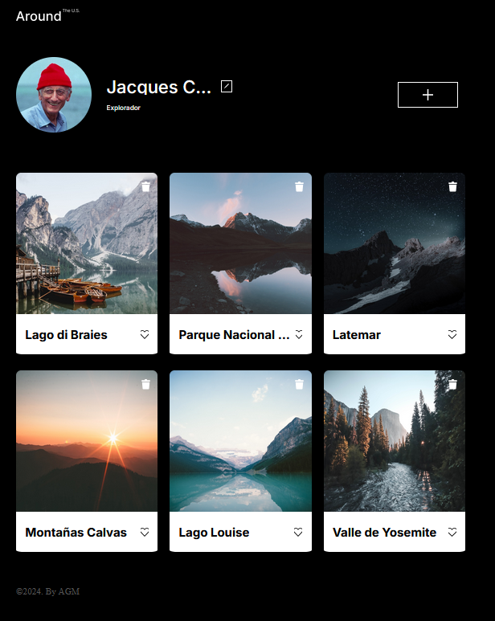

# Nombre del Proyecto 📛

web_project_around

## Descripción del Proyecto y su Funcionalidad 📖

Este proyecto tiene como objetivo mejorar mis habilidades en la creación de páginas responsivas para celulares, tablets y pantallas grandes. Proporciona ejemplos y ejercicios prácticos para adaptar el contenido web a diferentes tamaños de pantalla, asegurando una experiencia de usuario óptima en cualquier dispositivo. En este proyecto, estoy trabajando con JavaScript, el DOM, APIs y otras tecnologías relacionadas para crear una funcionalidad dinámica y mejorar la interactividad de la página.

## Descripción de las Tecnologías y Técnicas Utilizadas 🛠️

- **Lenguajes de Programación:** HTML, CSS y JS
- **Herramientas de Desarrollo:** VSCode, Git y Github.
- **Empaquetado de Módulos:** Webpack

## Demo del Proyecto

Puedes ver el proyecto en acción visitando este enlace: [Web Project CoffeeShop](https://zinderellasnuff.github.io/web_project_around/).

---

### Comentarios Básicos

- **Diseño Responsivo con CSS:** Se han implementado técnicas de diseño responsivo utilizando media queries en CSS. Esto permite ajustar el diseño y el contenido de la página dependiendo del tamaño de la pantalla del dispositivo.

- **Uso de Git y GitHub:** El control de versiones se ha gestionado con Git, y el código se ha alojado en un repositorio de GitHub para facilitar la colaboración y el despliegue continuo.

- **Imágenes y Multimedia Responsivas:** Las imágenes y otros elementos multimedia se han optimizado para ser responsivos, utilizando unidades relativas y propiedades como max-width para garantizar que estos elementos se redimensionen adecuadamente y mantengan su calidad en diferentes tamaños de pantalla.

- **Desarrollo con JavaScript y DOM:** El proyecto incluye la implementación de funcionalidades dinámicas utilizando JavaScript y el DOM (Document Object Model). Esto permite interacciones más complejas y la manipulación en tiempo real del contenido de la página, mejorando la experiencia del usuario.

- **Trabajo con APIs:** Se ha integrado el uso de APIs para obtener datos externos y enriquecer la funcionalidad de la aplicación, permitiendo interacciones más ricas y actualizaciones en tiempo real.

- **Implementación de Webpack:** Webpack se ha utilizado para empaquetar los módulos de JavaScript, optimizando el rendimiento del proyecto y facilitando la gestión de dependencias y recursos.
